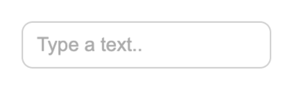
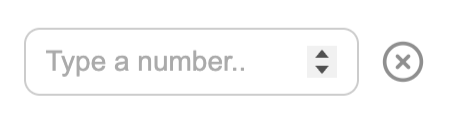
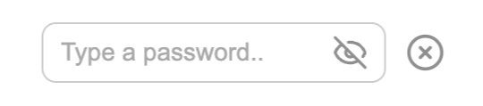
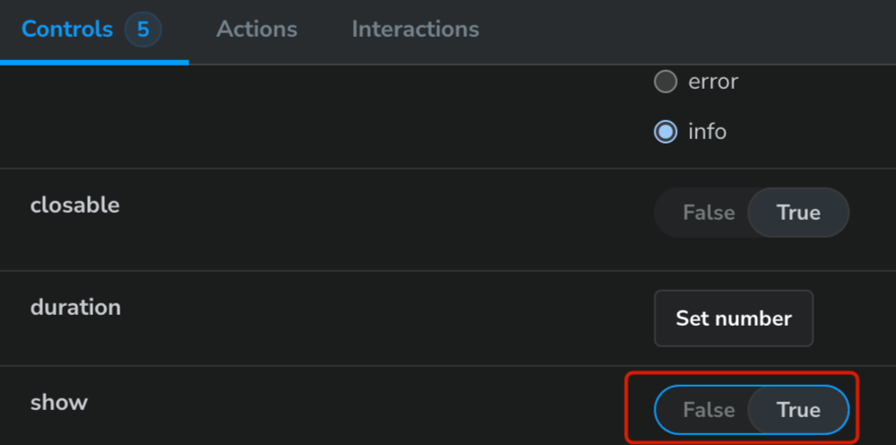
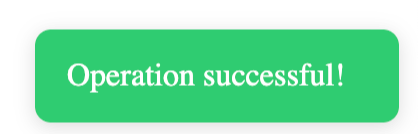
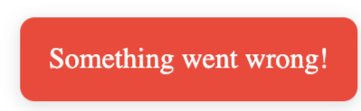
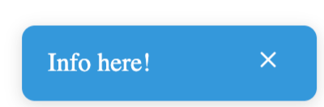
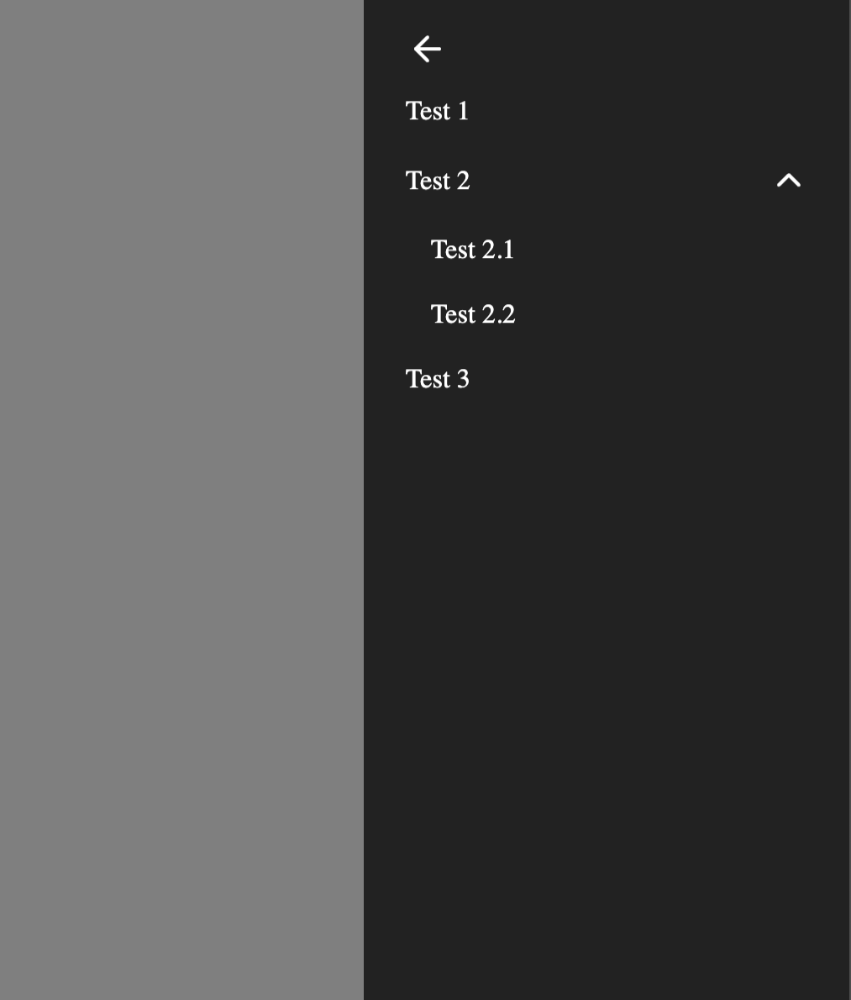

# DevelopsTodayTestTask

Test task link: [Front-end JS engineer test assessment – React component library](https://develops.notion.site/Front-end-JS-engineer-test-assessment-the-React-component-library-21b0fe54b07b80aa9607c6fc88aa90e0)

- Use `npm install` in the root folder to install dependencies.
- Use `npm run storybook` in the root folder to start Storybook in development mode.
- All components are located in `src/components`.

There are 3 components:

- **Input**
- **SidebarMenu**
- **Toast**

---

## Input

The Input component has the following options:

- **type** (`text | number | password`, default `text`) – type of input.  
  
- **clearable** (`boolean`, default `false`) – adds a button to clear the input.  
  
- **placeholder** (`string`, default empty) – placeholder text inside the input.  
  

---

## Toast

The Toast component has the following options:

- **message** (`string`, required) – the toast message text.
- **type** (`success | error | info`, default `success`) – toast type.
- **duration** (`number`, default `3000`) – duration of showing the toast in milliseconds.
- **closable** (`boolean`, default `false`) – adds a close button.
- **show** (`boolean`, default `false`) – trigger to show the toast.

In Storybook, you can toggle this option to display the toast:  

Toast types:  
  
  

---

## SidebarMenu

The SidebarMenu component has one option:

- **elements** (required) – an array of menu elements. Each element has the following structure:
    - **label** (`string`, required) – the element label
    - **onClick** (`function`, optional) – callback when the element is clicked
    - **children** (`array` of elements, optional) – submenu items, same structure as main elements

